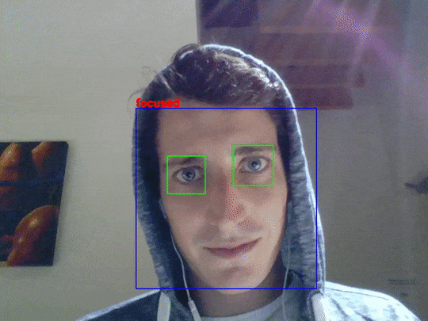

# Distraction Detector

Originally created for the Vancouver School of AI [Image Classification Workshop](https://github.com/SchoolofAI-Vancouver/learn_image_classification_2) Code Challenge.

| File  | Description  |
|---|---|
| [get_data.py](https://github.com/johannesharmse/distraction_detection/blob/master/src/get_data.py)  | Create training data for distraction CNN model  |
| [train.py](https://github.com/johannesharmse/distraction_detection/blob/master/src/cnn/train.py)  | Distraction Keras CNN Classifier Training  |
| [distraction_detector.py](https://github.com/johannesharmse/distraction_detection/blob/master/src/distraction_detector.py)  | Distraction Detector using OpenCV and Keras  |

